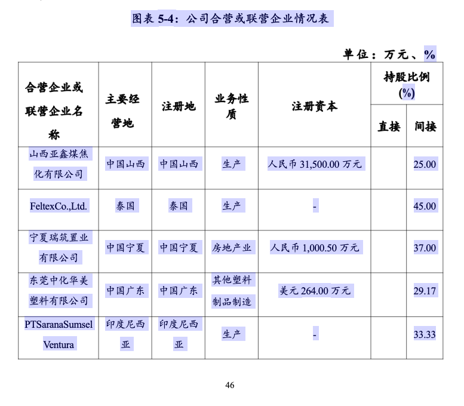
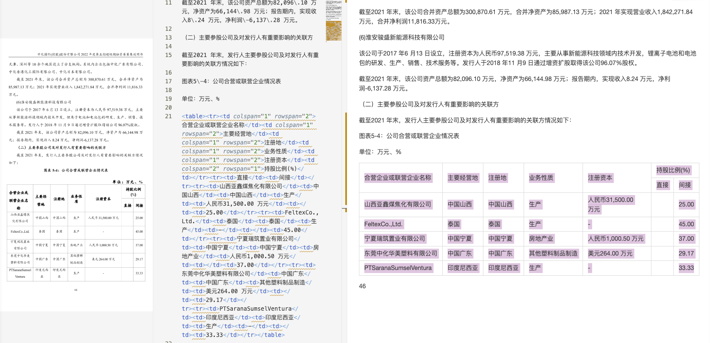
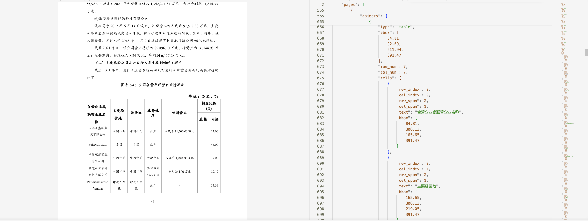
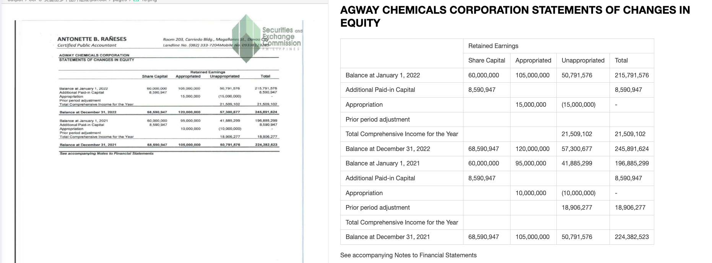
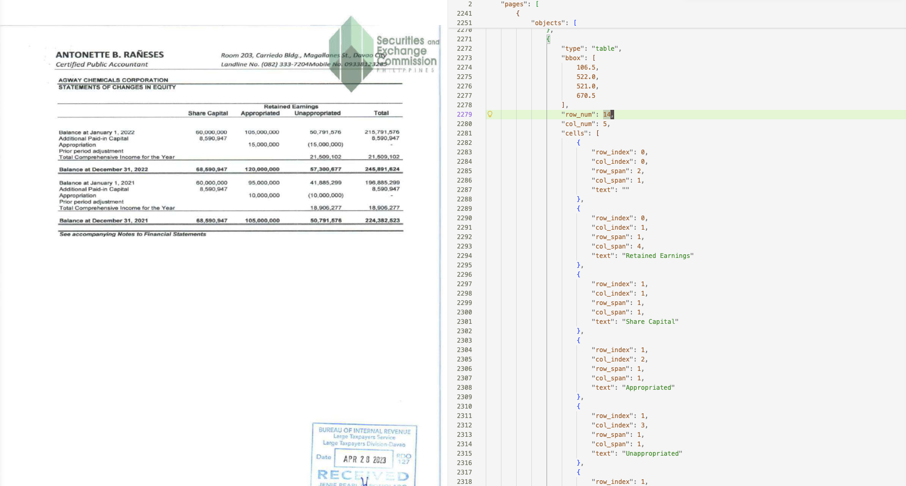
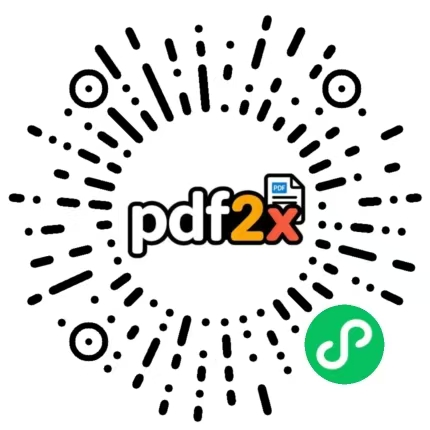

<p align="center">
   &nbsp;<strong style="font-size:1.5em">PPX — High-Accuracy PDF & Image Parser</strong>
</p>

[](https://pypi.org/project/memect-ppx/)
[](https://pypi.org/project/memect-ppx/)
[](https://www.python.org/)
[](LICENSE)
[](https://github.com/memect/memect-ppx/issues)

[简体中文](README_zh-CN.md) | English

---

**Convert PDF and images to structured Markdown / JSON — locally, accurately, production-ready.**

PPX is an open-source document parsing engine built for high-fidelity extraction of text, tables, figures, formulas, and layout from PDFs and images. It ships with a built-in OCR + layout pipeline and optionally offloads recognition to state-of-the-art LLM backends (DeepSeek-OCR, PaddleOCR-VL, GLM-OCR).

- **What output do I get?** — Markdown and JSON; every object carries page coordinates.
- **Do I need a GPU?** — No. The default backend runs on CPU. GPU (CUDA) is optional for throughput.
- **Does it handle scanned PDFs?** — Yes. OCR is applied automatically when native text is absent.
- **Can I use my own LLM?** — Yes. Any OpenAI-compatible endpoint is accepted via `--backend`.
- **Is it embeddable?** — Yes. Apache-2.0 allows commercial use, modification, and redistribution with minimal obligations.

---

## Get Started in 30 Seconds

```bash
# python version >= 3.12
uv venv -p 3.12
uv pip install memect-ppx 
uv pip install onnxruntime --no-config
uv pip install opencv-contrib-python --no-config
# update
uv pip install --upgrade memect-ppx
# or
python3.12 -m venv .venv
pip install memect-ppx 
pip install onnxruntime 
pip install opencv-contrib-python
# update
pip install --upgrade memect-ppx

# parse pdf
ppx parse document.pdf -o output/
```

PPX uses the pipeline mode by default. The parsed Markdown is typically written
to `output/doc.md` when `-o output/` is provided.

---

## What Problems Does This Solve?

| Problem | How PPX Handles It |
| ------- | ------------------ |
| Native-text PDF with invisible/garbled characters | Detects encoding anomalies; falls back to OCR per page |
| Scanned document with no embedded text | Full-page OCR or vLLM backend |
| Complex table spanning multiple columns/rows | LLM-based structural parsing, `colspan`/`rowspan` preserved |
| Math-heavy academic paper | LaTeX formula extraction |
| Batch processing thousands of files | Directory-level `parse dir/` with `-o output/` |

---

## Example Outputs

### Mixed table content

This example shows a mixed table scenario where the table body contains
editable text, while much of the header area is still image-based.

Input snippet:



Markdown output:



JSON output:



### Scanned English table

This example shows a scanned English table parsing result.

Markdown output:



JSON output:



---

## Benchmarks

See [docs/BENCHMARKS.md](docs/BENCHMARKS.md) for benchmark results, citation,
attribution, and compliance notes.

---

## Capability Matrix

| Capability | Default (Local) | DeepSeek-OCR | PaddleOCR-VL | GLM-OCR |
| ---------- | :-------------: | :----------: | :----------: | :-----: |
| Text extraction | ✅ | ✅ | ✅ | ✅ |
| Per-character coordinates | ✅ | ❌ | ❌ | ❌ |
| Table structure (colspan / rowspan) | ✅ | ✅ | ✅ | ✅ |
| Formula → LaTeX | ✅ | ✅ | ✅ | ✅ |
| Figure region extraction | ✅ | ✅ | ✅ | ✅ |
| CPU-only mode | ✅ | ✅ | ✅ | ✅ |
| CUDA acceleration | ✅ | ✅ | ✅ | ✅ |
| No external service required | ✅ | ❌ | ❌ | ❌ |

---

## Which Backend Should I Use?

| Scenario | Recommended Backend |
| -------- | ------------------- |
| Privacy-sensitive documents, air-gapped environment | `default` |
| Highest accuracy on complex layouts | `deepseek` |
| Good accuracy, lighter GPU footprint (~10 GB) | `paddle` |
| Fast inference with speculative decoding | `glm` |
| Quick integration test / CI pipeline | `default` (CPU) |

---

## Quick Start

### Default pipeline mode

```bash
ppx parse <input_path> -o <output_path>

# Example
ppx parse report.pdf -o output/
```

### Parse a single file

```bash
# Auto-detect whether OCR is needed
ppx parse report.pdf

# Force OCR on every page
ppx parse report.pdf --ocr yes

# Skip OCR entirely
ppx parse report.pdf --ocr no

# Parse an image
ppx parse scan.png
```

### Batch processing

```bash
# Parse all PDFs and images in a directory
ppx parse docs/

# Write output to a specific directory
ppx parse docs/ -o output/
```

### Use an LLM backend

```bash
# DeepSeek-OCR (requires ~20 GB VRAM via vLLM)
ppx parse report.pdf --backend deepseek \
  --deepseek '{"base_url":"http://127.0.0.1:4000/v1","model":"deepseek-ocr-2","api_key":""}'

# PaddleOCR-VL (requires ~10 GB VRAM)
ppx parse report.pdf --backend paddle \
  --paddle '{"base_url":"http://127.0.0.1:4001/v1","model":"paddleocr-vl","api_key":""}'

# GLM-OCR (requires ~10 GB VRAM)
ppx parse report.pdf --backend glm \
  --glm '{"base_url":"http://127.0.0.1:4002/v1","model":"glmocr","api_key":""}'
```

### Persist configuration

Tired of typing the same flags? Drop a config file:

```bash
mkdir conf
# conf/settings.py  (Python dict) or conf/settings.json
# Reference: src/memect/conf/settings.custom.py
```

```python
# conf/settings.py
settings = {
    "pdf_parser.deepseek.model.base_url": "http://127.0.0.1:4000/v1",
    "pdf_parser.paddle.model.base_url": "http://127.0.0.1:4001/v1",
    "pdf_parser.glm.model.base_url": "http://127.0.0.1:4002/v1",
}
```

Now just run:

```bash
ppx parse report.pdf --backend deepseek
```

---

## Use from python

PPX can be used directly as a library. If you call it repeatedly, a single global `Parser` instance is usually enough.

```python
from memect.pdf.parser import Parser
from memect.pdf.base import KDocument, KDocumentFactory

# If you call it repeatedly, a single global parser is usually enough.
# If no arguments are passed, the default settings are used.
with Parser() as parser:
    doc = KDocument("/path/your.pdf")
    parser.parse(doc)

# Batch parsing with multiprocessing and default settings.
doc = KDocumentFactory("/path/your.pdf", params=None)
docs = [doc]
Parser.batch(docs, max_workers=1)
```

---

## CLI Reference

```text
ppx parse <path> [OPTIONS]

Arguments:
  path          PDF file, image file, or directory

Options:
  --backend     default | deepseek | paddle | glm   (default: default)
  --ocr         yes | no | auto                      (default: auto)
  --table       no | ybk | wbk | auto | llm          (default: auto)
  --pages       Page range, e.g. "1-5,10"
  --mode        page | tree                    (default: page)
  -o, --output  Output directory
```

Other subcommands:

```text
ppx start               Launch HTTP API server
```

Hosted API trial: apply for a free API key at
<https://pdf2x.cn/api/apikey/page>, then call the API directly.

---

## Output Format

Each parsed document is written to `<input>.out/`:

```text
report.pdf.out/
├── doc.md          # full document in Markdown
├── doc.json        # full structured data with per-object coordinates
├── pages/          # per-page breakdown (one entry per page)
└── images/         # extracted figures/images (present when figures are detected)
```

| Path | Description |
| ---- | ----------- |
| `doc.md` | Markdown with figure references |
| `doc.json` | JSON tree: document → pages → objects, each with bounding-box coordinates |
| `pages/` | Per-page Markdown and JSON, useful for page-level processing |
| `images/` | Extracted image regions; only present when the document contains figures |

---

## Installation

### Option A — PyPI (recommended)

```bash
# Create a virtual environment
uv venv -p 3.12
source .venv/bin/activate

# CPU build
uv pip install memect-ppx
uv pip install onnxruntime --no-config
uv pip install opencv-contrib-python --no-config   # or opencv-contrib-python-headless


# GPU (CUDA) build
uv pip install memect-ppx[cuda]
uv pip install onnxruntime-gpu --no-config
uv pip install opencv-contrib-python --no-config

ppx --help

ppx parse document.pdf -o output/
```

> **Why install `onnxruntime` and `opencv` manually?**
> Third-party packages often pin different variants (`headless` vs `contrib`, `cpu` vs `gpu`).
> PPX excludes both from its dependency list so you stay in control of which variant is installed.

### Option B — From source

```bash
git clone https://github.com/memect/memect-ppx.git
cd ppx
uv venv -p 3.12
source .venv/bin/activate

# Install all dependencies (CPU)
uv sync --no-install-project
uv pip install onnxruntime --no-config
uv pip install opencv-contrib-python --no-config

# Or GPU
uv sync --extra cuda --no-install-project
uv pip install onnxruntime-gpu --no-config
uv pip install opencv-contrib-python --no-config
```

---

## Platform Support

| Platform | Python | CPU | CUDA | Notes |
| -------- | ------ | :-: | :--: | ----- |
| Linux | >= 3.12 | ✅ | ✅ | Recommended for production |
| macOS (Apple Silicon) | >= 3.12 | ✅ | ❌ | |
| macOS (Intel) | 3.12 – 3.13 | ✅ | ❌ | Capped by OpenVINO |
| Windows | >= 3.12 | ✅ | ✅ | Community-tested |

CUDA requires NVIDIA driver + CUDA 12.x and `onnxruntime-gpu` built for that CUDA version.

---

## Launching LLM Services

PPX LLM backends are served via [vLLM](https://github.com/vllm-project/vllm).

### DeepSeek-OCR-2 (~20 GB VRAM)

```bash
vllm serve ./hub/deepseek-ai/DeepSeek-OCR-2 \
  --served-model-name deepseek-ocr-2 \
  --logits-processors vllm.model_executor.models.deepseek_ocr:NGramPerReqLogitsProcessor \
  --mm-processor-cache-gb 0 \
  --no-enable-prefix-caching \
  --gpu-memory-utilization 0.8 \
  --port 4000
```

### PaddleOCR-VL / PaddleOCR-VL-1.5 (~10 GB VRAM)

```bash
vllm serve ./hub/PaddlePaddle/PaddleOCR-VL \
  --served-model-name paddleocr-vl \
  --trust-remote-code \
  --max-num-batched-tokens 16384 \
  --no-enable-prefix-caching \
  --mm-processor-cache-gb 0 \
  --gpu-memory-utilization 0.5 \
  --port 4001
```

> Replace `PaddleOCR-VL` with `PaddleOCR-VL-1.5` to use the newer model; port and `--served-model-name` remain the same.

### GLM-OCR (~10 GB VRAM)

```bash
# Requires transformers >= 5.3.0
uv pip install "transformers>=5.3.0"

vllm serve ./hub/ZhipuAI/GLM-OCR \
  --served-model-name glmocr \
  --max-num-batched-tokens 16384 \
  --max-model-len 16384 \
  --speculative-config '{"method": "mtp", "num_speculative_tokens": 1}' \
  --gpu-memory-utilization 0.5 \
  --port 4002
```

Model source: [ModelScope — ZhipuAI/GLM-OCR](https://modelscope.cn/models/ZhipuAI/GLM-OCR)

## FAQ

### Does PPX support password-protected PDFs?

Not currently. Strip the password with a tool like `qpdf` before passing the file to PPX.

### How do I resolve `opencv` version conflicts?

Uninstall all existing opencv variants first, then reinstall:

```bash
uv pip uninstall opencv-python opencv-contrib-python \
                  opencv-python-headless opencv-contrib-python-headless
uv pip install opencv-contrib-python --no-config
```

### `ImportError: libGL.so.1` on Linux servers

Install the headless OpenCV variant instead:

```bash
uv pip install opencv-python-headless
```

Or install the system library: `sudo apt-get install -y libgl1`

### Can `onnxruntime` and `onnxruntime-gpu` coexist?

No. Install exactly one. The GPU variant must match your system's CUDA version.

### Can I use PPX on Mac with GPU acceleration?

No. Neither Apple Silicon nor Intel Macs support CUDA. The CPU backend works on both.

### Can I embed PPX in a commercial product?

Yes. Apache-2.0 allows using PPX in proprietary and commercial software with minimal redistribution requirements.

### How do I parse only specific pages?

```bash
ppx parse report.pdf --pages "1-5,10,15-20"
```

---

## Product Experience

Web experience for pdf2x: <https://pdf2x.cn/>

[Apply for a free API key](https://pdf2x.cn/api/apikey/page) to call the API.

Mini Program experience:



---

## Contributing

We welcome bug reports, feature requests, and pull requests.

1. Fork the repository and create a feature branch.
2. Run tests: `uv run pytest`
3. Submit a PR — please describe the motivation and include test cases.

See [CONTRIBUTING.md](CONTRIBUTING.md) for full guidelines.

---

## License

PPX is released under the [Apache License 2.0 (Apache-2.0)](LICENSE).

Apache-2.0 allows commercial use, modification, redistribution, and internal use with minimal obligations. It also includes an express patent license from contributors.

For bundled third-party code and assets, see [NOTICE](NOTICE) and [docs/THIRD_PARTY_LICENSES.md](docs/THIRD_PARTY_LICENSES.md). Those files document attribution and redistribution review items for vendored components and bundled resources shipped with this repository.
